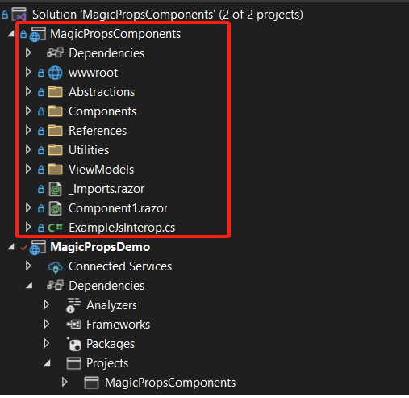
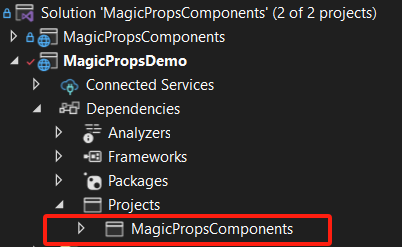
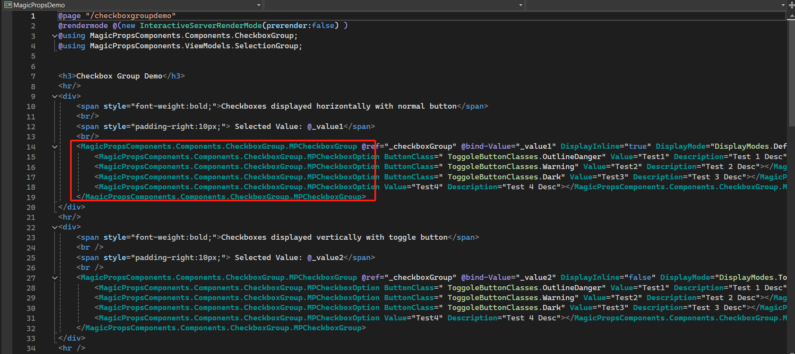

# Magic Props Blazor Components
This is a versatile Blazor component that you can seamlessly integrate into your project, offering a multitude of customizable settings.

**Blazor Components Demos**

This Demo project shows up the demos how we use the blazor components we developed.
The componnets inlcude but not limit to Modal, Input, Checkbox, Radio buttons and more.

**How to use these Components**
1. First you need to download our componnet project  
   

2. Include this project in your own solution and build it   
   

3. Add this project into dependencies of your own project  
   

4. Then you can use the related components  

If you encounter any difficulties while utilizing the associated component, please kindly download our demo project. It will provide a clear demonstration of how we effectively employ the components, serving as a valuable reference for you.  
Details please go to [detail.md](./Detail_ReadMe/pivottable.md)

