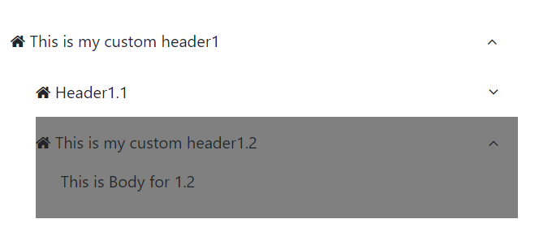
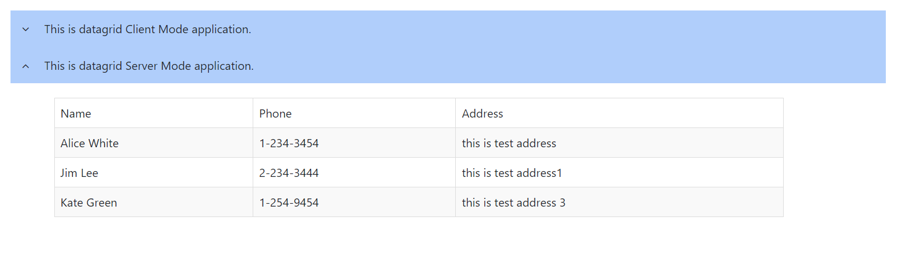

[Home](https://github.com/FreedomOnes82/MagicPropsBlazorComponents/blob/main/README.md)     

**Accordion**    
**Demo Images**:  
Here are a few demonstrative images that offer you a comprehensive overview of our accordion component.    

**Introduction**:  

 Accordion is a component that enables the expansion and collapse of corresponding panels, providing a dynamic and space-saving interface for displaying information.
 Here are the details about each setting:   
 * **Width**: Specifies the width of the accordion.
 * **HeaderTemplate**: Allows for the inclusion of HTML code or elements that are appended to the header of the component.
 * **BodyTemplate**: Allows for the inclusion of HTML code or elements that are appended to the body of the component.
 * **Disabled**: Property to control if the accordion disabled or not, default value is false.  
 * **Expanded**: A property to manage whether the accordion is initially expanded or collapsed upon first display, default value is false.
 * **HideIcon**: Property to control if the icon on the right hidden or not, default value is false.  
 * **HoverTitle**: Setting for the title when mouse hover on the component.
 * **ClientID**: A unique identifier (id) for this component, allowing for specific targeting and styling via CSS or JavaScript.
 * **OnClickHeader**: A function that can be assigned to this property. When click on the header of accordion, this function is automatically triggered, allowing for dynamic updates or validation checks or anything else you want to do.

