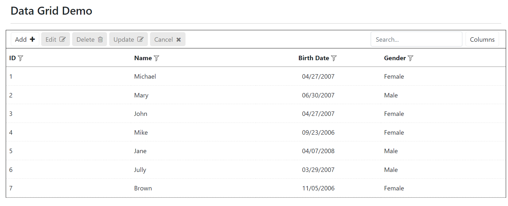
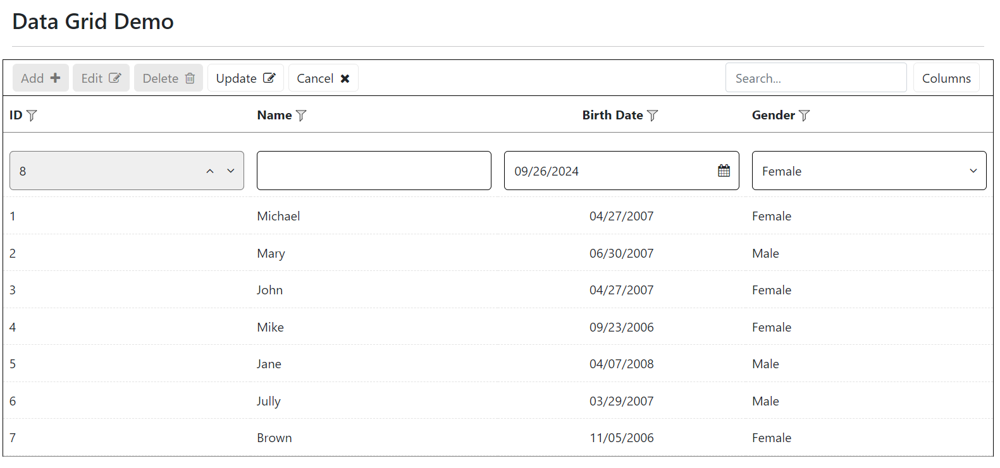
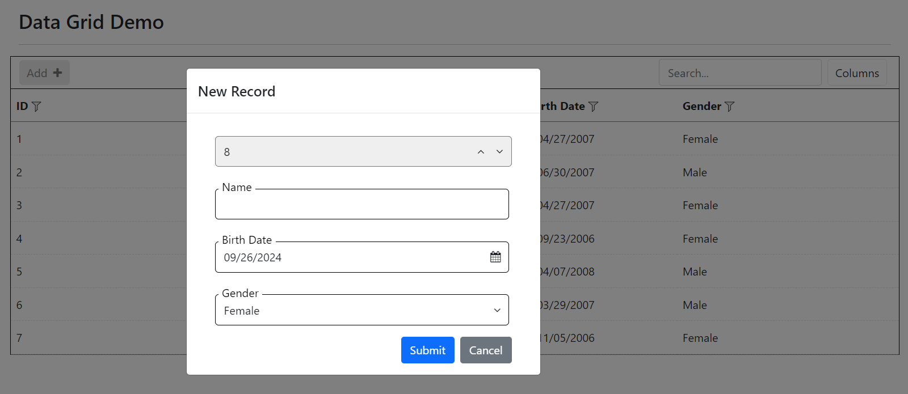
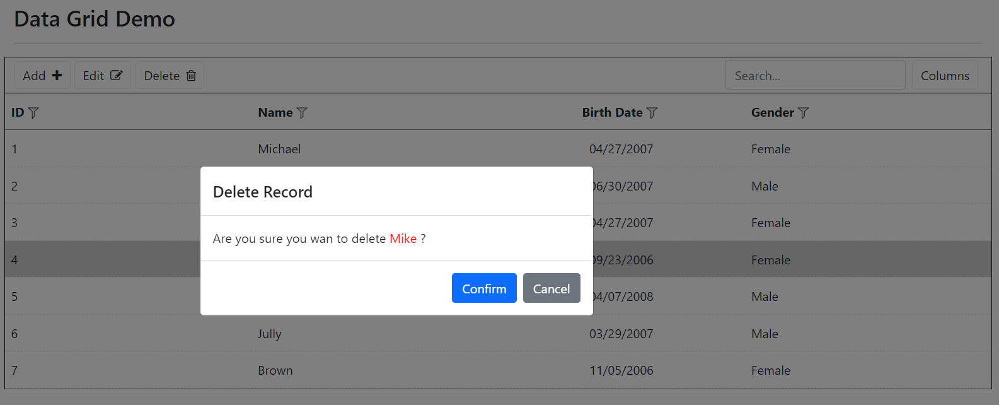
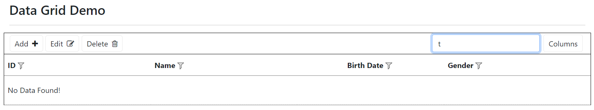
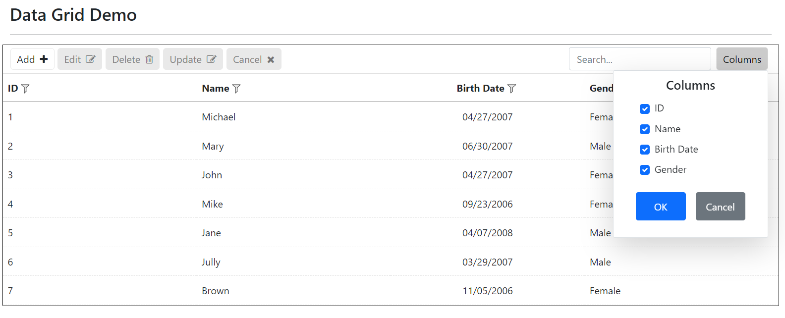
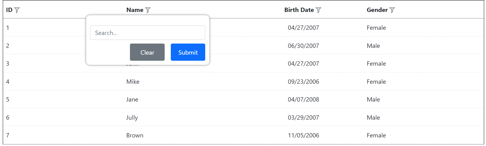
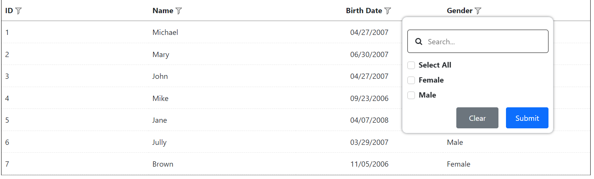

[Home](https://github.com/FreedomOnes82/MagicPropsBlazorComponents/blob/main/README.md)     

**Data Grid**    
**Demo Images**:  
Here are a few demonstrative images that offer you a comprehensive overview of our data grid components.  
Data Grid overview diagram:     

Data Grid column chooser:

Data Frid filter part:   

**Introduction**:  
   Data Grid is a component specifically engineered to display data sourced from a database. It further empowers users by providing seamless capabilities to add new entries, edit existing ones, and delete rows as needed.
   Here are the key properties related to the Data Grid component (Including MPDataGrid and MPGridColumn), which provide customization options for both its display and functionality:
   **MPDataGrid**:    
   * **Width**:Specifies the width of the data grid.
   * **Height**:Specifies the height of the data grid. Note: if you specifies the height less than 300 then system will use 300 as default.  
   * **CaseSensitive**:A boolean value (true or false) that determine whether the string value is case sensitive when doing the filter for the results, it used for both string comparison for filter on each column and also used for search textbox in toolbar which do global search. Default value is false.
   * **ColumnChooserText**:Text shown up for Choose Column button in  the right side of toolbar. System will use "Column Chooser" if you did not specify a value for it.  
   * **CustomToolBtns**:You can add related custom buttons in toolbar with this property if you need.It should be ToolButton type.
   * **ChildContent**:Permits the seamless integration of HTML code or elements, which can be appended to the individual column within the data grid typically achieved through the use of MPGridColumn component. This feature enhances the flexibility and customizability of the data grid, allowing for the inclusion of additional information, styling, or interactive elements alongside each column.
   * **NoDataTemplate**:Permits the seamless integration of HTML code or elements, which can be appended to the data grid when there is no  data show up with related filter or no data for the table.
   * **NoDataText**:Same function as NoDataTemplate to show up text in data grid if there is no data return back from datasource but it is without any style and only with text there. Please note:  if you use both, system will use NoDataTemplate and ignore NoDataText.   
   * **Datasource:**:Binding the datasource for the data grid table. It can be not only data from all kinds of database, such as MSSQL, MySQL, Postgresql and so on but also it can get data from JSON file.
   * **OperationSettings**:A serial settings for related operation to the data grid, such as allow adding a new row, allow deleting, allow editing and so on. Here are each settings:  
   (1) AllowAdding:  A boolean value (true or false) that determine whether user can add a new row for the table. Default value is false, that is user can not add a new row, at this time, the add button is hidden in the toolbar.  
   (2) AllowDeleting: A boolean value (true or false) that determine whether user can delete a record or not from the table. Default value is false,that is user can not delete the row, at this time, the delete button is hidden in the toolbar.  
   (3) AllowEditing: A boolean value (true or false) that determine whether user can edit a record or not from the table. Default value is false,that is user can not edit the row, at this time, the edit button is hidden in the toolbar.  
   (4) AllowGlobalSearch: A boolean value (true or false) that determine whether user can do a global search. Default value is false, that is user cannot do the search, at the same time, the search textbox is hidden in the toolbar.    
   (5) ShowColumnChooser: A boolean value (true or false) that determine whether user can choose the column to show or not from the list . Default is false, that is user cannot do the choose, at the same time, the choose button is hidden in the toolbar.  
   (6) EditingTrigger: the mode using for edit, two options for it, RowClick is editting when click the row. RowDblClick is eidtting the row when double click the row.

   * **EditMode**:Setting for edit mode. Default is edit in row within data table. Dialog is openning a dialog for user to do the edit.
   * **PaginationSettings**:ettings for pagination,here are each settings:  
   (1) EnablePagination: A boolean value (true or false) that determine whether the data grid can be pagination.  
   (2) PaginationMode: A setting to show if pagination is client side or server side. If it is client side, it means, we get all of the data from database in the beginning and then do the paging in client. If we use server mode, then each time, we get only the certain page's data from the database. If the data is large we recommend to use the server mode.  
   (3) PageSize: to set how many records in one page, default value is 20.
   
   * **OnDeleteRowData:**:A function that can be assigned to this property. When delete a row  from the data grid, this function is automatically triggered, allowing for dynamic updates or validation checks or anything else you want to do.
   * **OnUpdateRowData**:A function that can be assigned to this property. When update a row  for the data grid, this function is automatically triggered, allowing for dynamic updates or validation checks or anything else you want to do.
   * **OnAddRowData**:A function that can be assigned to this property. When add a row for the data grid, this function is automatically triggered, allowing for dynamic updates or validation checks or anything else you want to do.
   * **SelectedRow**: Specifies the seletected row of the data grid in the initial. If you want to use this, you need specify PrimaryColumn for at least one MPGridColumn.  
   * **SelectedRowChanged**:A function that can be assigned to this property. When select a row from one to another for the data grid, this function is automatically triggered, allowing for dynamic updates or validation checks or anything else you want to do.
   * **RecordsTotal**: For server mode, since the data just get the data needs for one page, we need to kow total records for all of the pages, and this property is using to do this settings. 
   * **CurrentPageIndex**:Specifies  for the current page index.
   * **CurrentPageIndexChanged**:function that can be assigned to this property. When the page changes for the data grid, this function is automatically triggered, allowing for dynamic updates or validation checks or anything else you want to do. 
   * **OnDataRetrieving**:function that can be assigned to this property. When the page changes for server mode, then system will need to get data from database for the new page for the data grid, this function is automatically triggered, allowing for dynamic updates or validation checks or anything else you want to do.
   * **EditDialogTemplate**:Permits the seamless integration of HTML code or elements, which can be appended to the dialog  shown up when edit the the individual row within the data grid. This feature enhances the flexibility and customizability of the data grid, allowing for the inclusion of additional information, styling, or interactive elements alongside each column in the openning dialog.
   * **DeleteDialogTemplate**:Permits the seamless integration of HTML code or elements,which can be appended to the dialog  shown up when  confirm before user delete a row within the data grid. This feature enhances the flexibility and customizability of the confirm message.

  
   **MPGridColumn**:    
   * **Width**: Specifies the width of the grid column.
   * **Visible**: A boolean value (true or false) that to see the column is visible or not.   
   * **ColumnName**: Specifies the column name for the column.
   * **HeaderText**: Specifies the header text to show up in the column.  
   * **FilterType**:   
   * **Format**:   
   * **CultureString**:  
   * **AggregateFunction**: 
  
