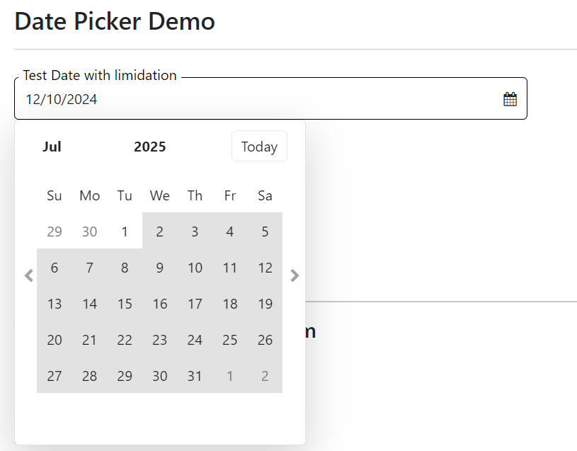
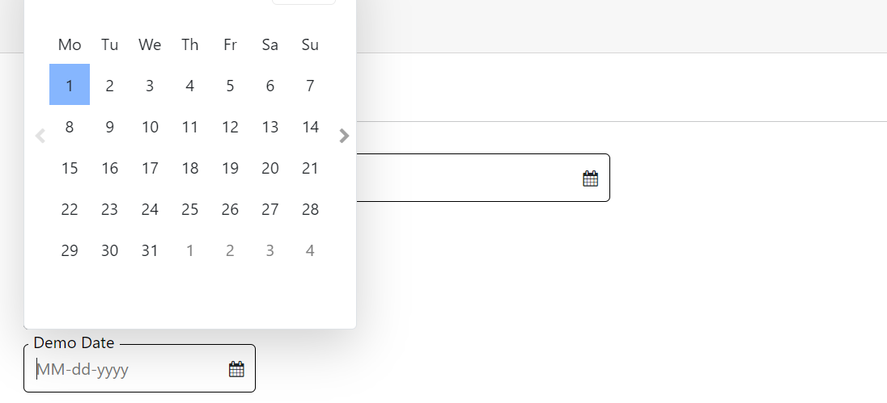
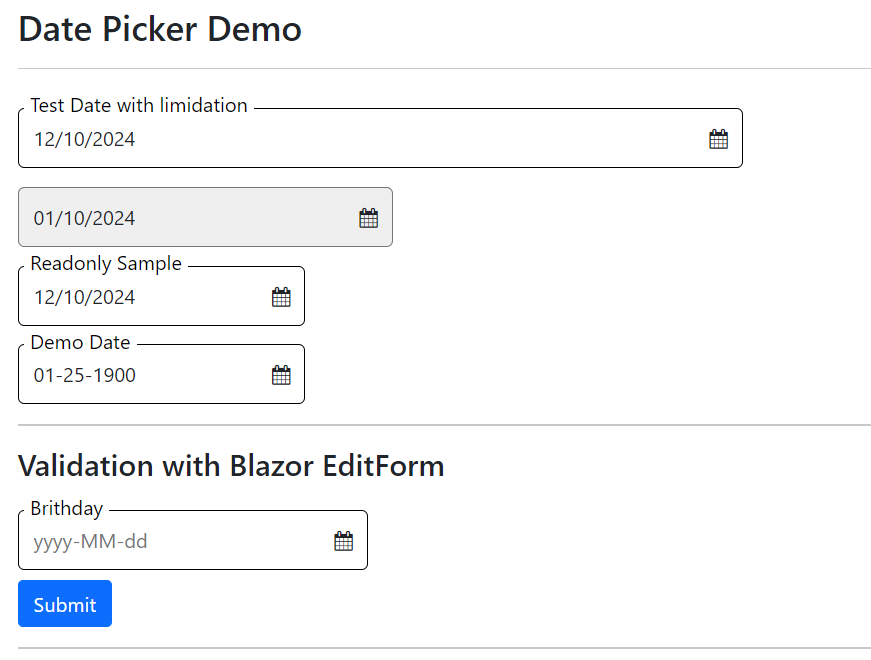
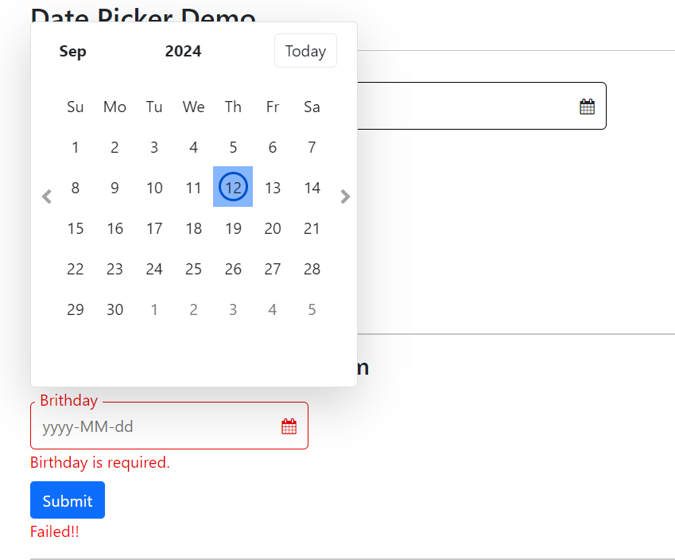
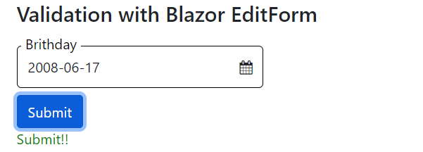
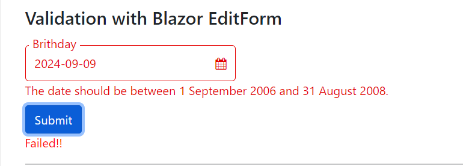
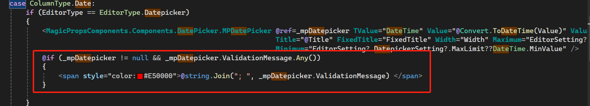

[Home](https://github.com/FreedomOnes82/MagicPropsBlazorComponents/blob/main/README.md)     

**Date Picker**    
**Demo Images**:  
Here are a few demonstrative images that offer you a comprehensive overview of our date picker component.    
    
  
    

  

    

**Introduction**:  

Date Picker is a component that enables users to select a specific date from a visual calendar interface.    

Here are the refined details for each property along with its respective function:   
* **StartsWithMonday**: A boolean value (true or false) that controls whether this canlendar start with Monday, that is Monday in the first column. Default value is false,canlendar start with Sunday.
* **Disabled**: A boolean value that determines whether this date picker is disabled or not. If set to true, the date picker becomes inactive.
* **Readonly**: A boolean flag that specifies whether the date picker is read-only. When set to true, users cannot modify the value.
* **Width**: Specifies the width of the component element. The minimum acceptable value is 80, allowing for flexible sizing to accommodate different design requirements.
* **Title**: Defines the title attribute for the date picker, which can be displayed as a tooltip when the user hovers over the input of this component.
* **InputID**: A unique identifier (id) for the input inside the date picker component, allowing for specific targeting and styling via CSS or JavaScript.
* **Value**: Sets the initial or current value of the date picker. This can be used to pre-populate the component with data or to manage its state programmatically.
* **FixedTitle**: A boolean property that ensures the title of the date picker is always displayed on the left side of the input box, regardless of whether the it has a value. This is useful for descriptive or instructional titles.
* **ValueChanged**: A function that can be assigned to this property. When the value of the date picker changes, this function is automatically triggered, allowing for dynamic updates or validation checks.
* **DateFormatString**: This property allows you to specify the format in which dates are displayed in the date picker. You can use any valid date format string, such as 'yyyy-MM-dd', 'MM/dd/yyyy', 'MM-dd-yyyy', among others. If you do not set this property, the date picker will default to the date format of your culture settings.
* **Maximum**: The max date you can choose or enter for this date picker. Default date is 12/31/2099.
* **Minimum**: The min date you can choose or enter for this date picker. Default date is 01/01/1900.
          
Additionally, we can leverage Blazor EditForm for input validation, utilizing a property specifically designed for this purpose:  
* **ValidationFieldName**: This property designates the field within a class that is bound to the EditForm for validation purposes. If the field's name coincides with the title of the input, this property can be omitted, and the title can be directly referenced for validation.

In addition to the parameters mentioned, for this component, we require a List<string> named ValidationMessage. 
This list captures and stores error messages encountered during validation, enabling you to utilize them and display them on the page as necessary.
Here's how to use the ValidationMessage:  

   
