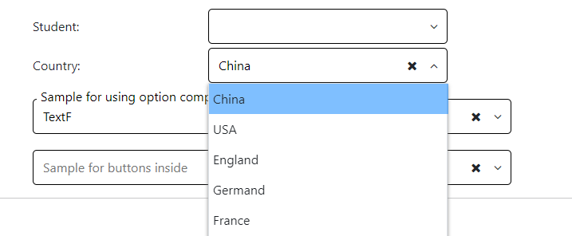
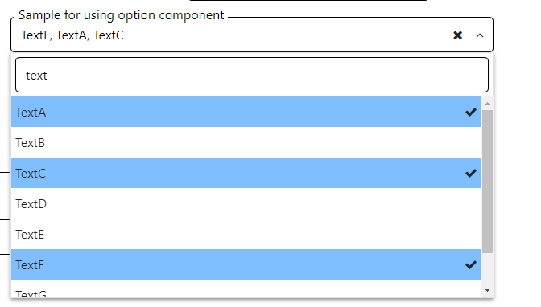
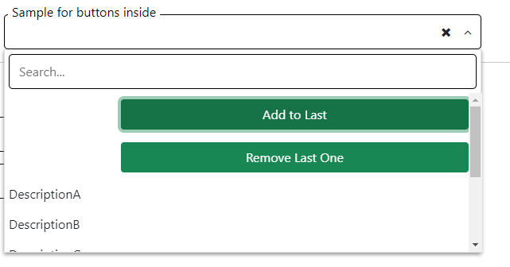
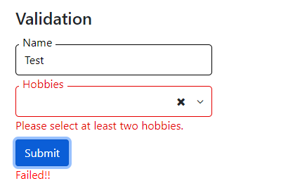
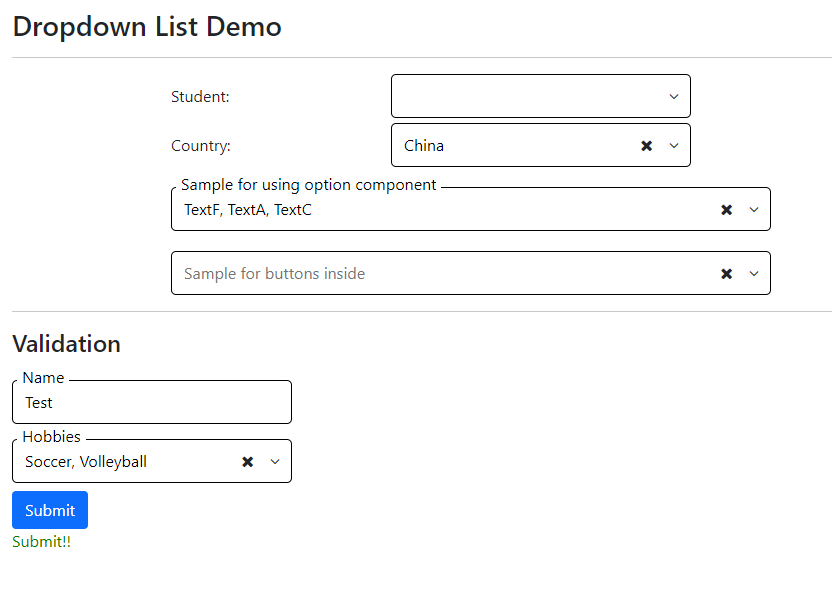
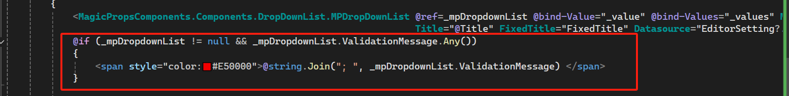

[Home](https://github.com/FreedomOnes82/MagicPropsBlazorComponents/blob/main/README.md)     

**Dropdown List**    
**Demo Images**:  
The following demonstrative image offer you a comprehensive overview of our dropdown list component.   
  

  
  

**Introduction**:  

This component has been meticulously crafted to seamlessly integrate a versatile dropdown list onto your webpage, empowering you with the flexibility to configure it according to your individual preferences and requirements.  
Here are the key properties related to the tab group component (Including MPDropDownList and MPDropDownListOption), which provide customization options for both its display and functionality.   

Please note that you can exclusively use MPDropDownList to bind a datasource to the dropdown list, without directly utilizing MPDropDownListOption. However, should you desire to enrich your dropdown list beyond mere options, for instance, add buttons inside it, you must employ both MPDropDownList and MPDropDownListOption simultaneously to handle option bindings.

Additionally, if your datasource comprises a class, it is imperative to define TextBy and ValueBy attributes to ensure seamless functionality and accurate representation of your data within the dropdown list.  

**MPDropDownList**:    
 * **Title**: Defines the title attribute for the it, which can be displayed as a tooltip when the user hovers over the dropdown list.
 * **FixedTitle**: A boolean property that ensures the title of the dropdown list is always displayed on the left-top side of it, regardless of whether the input has a value. This is useful for descriptive or instructional titles.
 * **Placeholder**: A string value that provides a hint or sample text for the dropdown list. This placeholder text disappears when the user selected the options.
 * **Visible**: A boolean value (true or false) that controls whether this dropdown list is visible on the interface. Setting it to false will hide the dropdown list from the user.
 * **Disabled**: A boolean value that determines whether this dropdown list is disabled or not. If set to true, the dropdown list becomes inactive and users cannot interact with it.
 * **Width**: Specifies the width of the dropdown list. The minimum acceptable value is 100, allowing for flexible sizing to accommodate different design requirements.
 * **Multiple**: A boolean flag that specifies whether the dropdown list is multiple selected or not. When set to true, users can select more than one value from the option list.
 * **Searchable**: A boolean flag that specifies whether the dropdown list has a search input in it or not. When set to true, users can see there is a search input inside it allow use to search for special values in the option list.
 * **Casesensive**: A boolean flag that specifies whether the dropdown list casesensive or not when doing the search.It only useful when Searchable set to true.
 * **Clearable**: A boolean attribute that indicates whether a clear button should be displayed to the right of the dropdown list. When clicked, the clear button removes all options from the field, providing a convenient way for users to reset the value.
 * **MaxHeight**: Specifies the max height of the dropdown list. The default value is 250.
 * **ChildContent**: Permits the seamless integration of HTML code or elements, which can be appended to the individual items within the dropdown list, typically achieved through the use of MPDropDownListOption or similar components. This feature enhances the flexibility and customizability of the tab group, allowing for the inclusion of additional information, styling, or interactive elements alongside each option.
 * **Datasource**: Specifies the datasource for this dropdown list.
 * **TextBy**: Specifies the field from datasource for text shown up in this dropdown list.This is required when datasouece is a class while not a list of string.
 * **ValueBy**: Specifies the field from datasource for value in this dropdown list.This is required when datasouece is a class while not a list of string.
 * **Value**: Sets the initial or current value of the element. This can be used to pre-populate the dropdown list with data or to manage its state programmatically.
 * **ValueChanged**: A function that can be assigned to this property. When the value of the dropdown list changes, this function is automatically triggered, allowing for dynamic updates or validation checks.
 * **Values**: Sets the initial or current values of the element when multiple selected. This can be used to pre-populate the dropdown list with data or to manage its state programmatically.
 * **ValueChanged**: A function that can be assigned to this property when Multiple is true. When the values of the dropdown list changes, this function is automatically triggered, allowing for dynamic updates or validation checks.
 * **ClientID**: A unique identifier (id) for this component, allowing for specific targeting and styling via CSS or JavaScript.
 * **InputID**: A unique identifier (id) for input inside this dropdown list, allowing for specific targeting and styling via CSS or JavaScript.
 * **ValidationFieldName**: Specifies validation field from fileds in datasouce to let edit form know which field need to validate, only used within EditForm.
         
**MPDropDownListOption**:  
* **Text**: Configuration for text part for each dropdown list option.
* **Value**: Configuration for value part for each dropdown list option.

Additionally, we can leverage Blazor EditForm for validation, utilizing a property specifically designed for this purpose:  
* **ValidationFieldName**: This property designates the field within a class that is bound to the EditForm for validation purposes. If the field's name coincides with the title of this component, this property can be omitted, and the title can be directly referenced for validation.

In addition to the parameters mentioned, for this component, we require a List<string> named ValidationMessage. 
This list captures and stores error messages encountered during validation, enabling you to utilize them and display them on the page as necessary.
Here's how to use the ValidationMessage:

