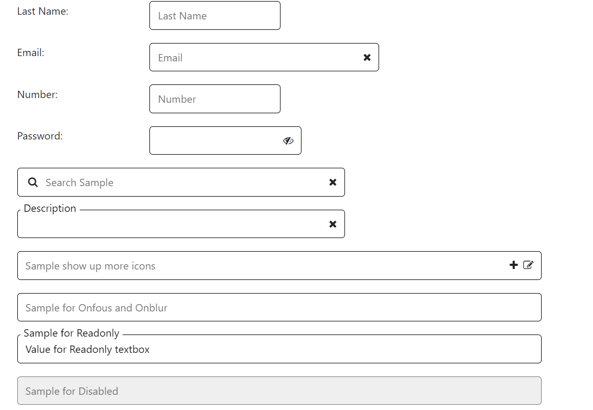
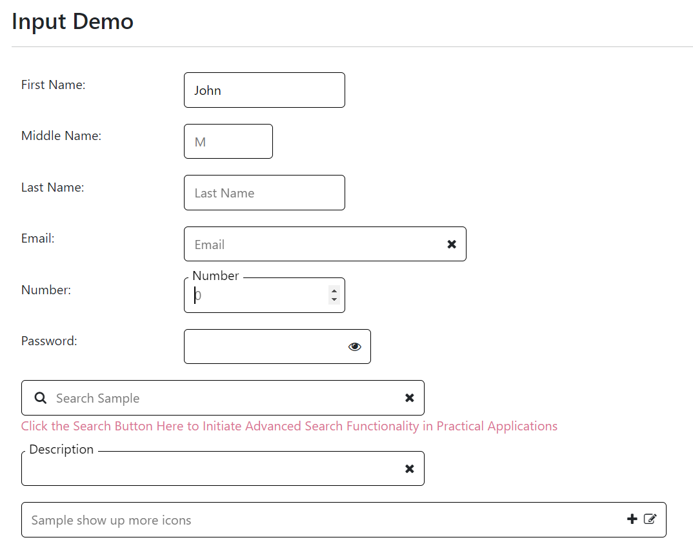
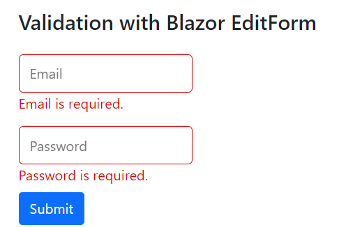
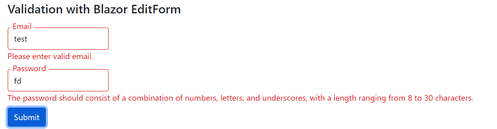
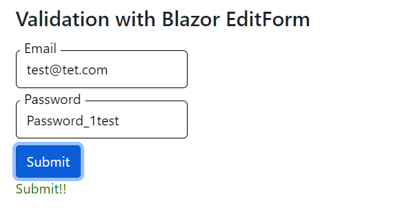

[Home](https://github.com/FreedomOnes82/MagicPropsBlazorComponents/blob/main/README.md)     

**Input**    
**Demo Images**:  
Here are a few demonstrative images that offer you a comprehensive overview of our input component.    
    

    

    

    

**Introduction**:  

The Input component serves as a versatile tool for capturing values from users.   
We have meticulously crafted three distinct types for this component to cater to various needs: text, number, and password.    
* Text Type: This is the most basic and versatile type, allowing users to enter any characters or text strings. It offers a flexible solution for a wide range of input scenarios.
* Number Type: Specifically designed for numeric inputs, this type restricts users to entering only numbers. It ensures data accuracy and simplifies validation for numerical data fields.
* Password Type: Ideal for password inputs, this type masks the actual value entered by the user with dots or asterisks, enhancing security and privacy.        
  
Furthermore we have developed numerous properties to enrich your user experience and streamline development. These properties offer fine-grained control over the appearance, behavior, and validation of the Input component, ensuring it seamlessly fits into your application's requirements.    
Here are the refined details for each property along with its respective function:   
* **Visible**: A boolean value (true or false) that controls whether this input element is visible on the interface. Setting it to false will hide the input from the user.
* **Disabled**: A boolean value that determines whether this input is disabled or not. If set to true, the input becomes inactive and users cannot interact with it.
* **Readonly**: A boolean flag that specifies whether the input is read-only. When set to true, users cannot modify the input's value but can still copy and select the text.
* **Width**: Specifies the width of the input element. The minimum acceptable value is 60, allowing for flexible sizing to accommodate different design requirements.
* **AutoFocus**: A boolean attribute that automatically focuses the input when the page loads. Note: If multiple inputs have AutoFocus set to true, only the first one encountered in the HTML will receive focus.
* **Placeholder**: A string value that provides a hint or sample text for the input field. This placeholder text disappears when the user clicks inside the input or starts typing.
* **Title**: Defines the title attribute for the input element, which can be displayed as a tooltip when the user hovers over the input.
* **InputID**: A unique identifier (id) for this input, allowing for specific targeting and styling via CSS or JavaScript.
* **InputType**: Specifies the type of input control to display. Supported types include text (default), number, and password. Each type determines the type of data that can be entered and how it is displayed.
* **Clearable**: A boolean attribute that indicates whether a clear button should be displayed to the right of the input. When clicked, the clear button removes all user input from the field, providing a convenient way for users to reset the input value.
* **Value**: Sets the initial or current value of the input element. This can be used to pre-populate the input with data or to manage its state programmatically.
* **FixedTitle**: A boolean property that ensures the title of the input is always displayed on the left side of the input box, regardless of whether the input has a value. This is useful for descriptive or instructional titles.
* **ValueChanged**: A function that can be assigned to this property. When the value of the input changes, this function is automatically triggered, allowing for dynamic updates or validation checks.
* **OnFocus**: A function that executes when the input element gains focus. This can be used to perform actions such as displaying additional instructions or clearing the input's value.
* **OnBlur**: A function that executes when the input element loses focus. This is useful for validating the input's value, clearing temporary UI elements, or performing other cleanup tasks.
* **LeftAppend**: Allows for the inclusion of HTML code or elements that are appended to the left side of the input box. This can be used to add icons, buttons, or other interactive elements that enhance the input's functionality.
* **RightAppend**: Similar to LeftAppend, but appends HTML code or elements to the right side of the input box. This provides flexibility in designing input fields with additional controls or visual elements.  

          
Additionally, we can leverage Blazor EditForm for input validation, utilizing a property specifically designed for this purpose:  
* **ValidationFieldName**: This property designates the field within a class that is bound to the EditForm for validation purposes. If the field's name coincides with the title of the input, this property can be omitted, and the title can be directly referenced for validation.

   
