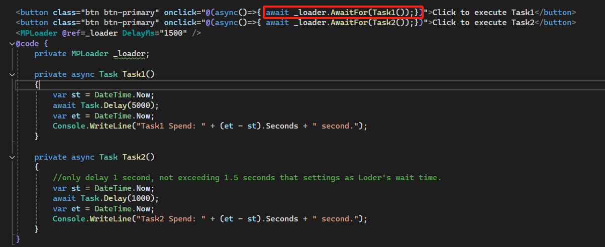

[Home](https://github.com/FreedomOnes82/MagicPropsBlazorComponents/blob/main/README.md)     

**Loader**    
**Demo Images**:  
Here is a image which offer you a comprehensive overview of our loader component.    

**Introduction**:  

The loader component is a very simple component which you can use when page is loading. 
There is only one property for this component: 
 * **DelayMs**: Setting for time before loader is showing up. Unit is milli second. Default value is 500, that means the loading circle will show up if the page is not ready after 500 milli seconds.

 In addition, there is a public function named AwaitFor you can use to show up the loader, here is the sample:

