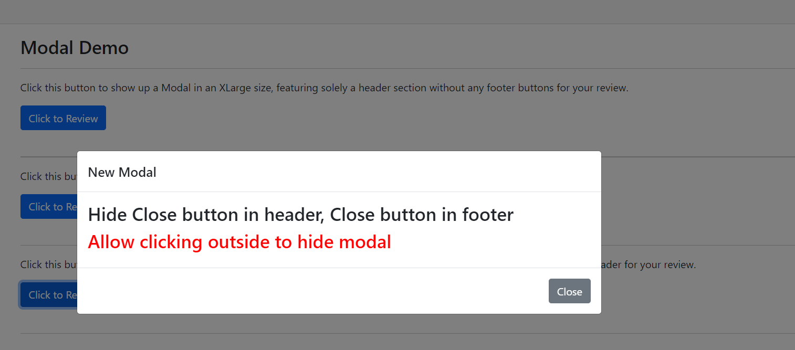

[Home](https://github.com/FreedomOnes82/MagicPropsBlazorComponents/blob/main/README.md)     

**Modal**    
**Demo Images**:  
Here are a few demonstrative images that offer you a comprehensive overview of our modal component.    
  
  

**Introduction**:  

 The Modal is use a seriel setting to show up differnt modal popups, here are the details about each setting:  
 * **HeaderTemplate**: Allows for the inclusion of HTML code or elements that are appended to the header of the modal.
 * **BodyTemplate**: Allows for the inclusion of HTML code or elements that are appended to the body of the modal.
 * **FooterTemplate**: Allows for the inclusion of HTML code or elements that are appended to the footer of the modal.
 * **Visible**: property to control the modal shows up or not
 * **VisibleChanged**: A function that can be assigned to this property. When the value of the visible changes, this function is automatically triggered, allowing for dynamic updates or validation checks or anything else you want to do.
 * **Size**: Setting for the size for this modal, it can be "ModalSettings.Small", "ModalSettings.Normal","ModalSettings.Large" and "ModalSettings.XLarge"
 * **Title**: Setting for the title for this modal
 * **ClientID**: A unique identifier (id) for this component, allowing for specific targeting and styling via CSS or JavaScript.
 * **CloseBtnVisible**: True or False, to control if the close button visible or not
 * **HeaderVisible**:True or False, to control if the header visible or not
 * **FooterVisible**:True or False, to control if the footer visible or not
 * **ClickOutsideToClose**: True or False, to control if the modal close when user click the outside place
 * **FooterBottons**: Setting for you to add a list of ModalButton there to show up in Footer of this modal
 * **OnModalButtonClicked**:A function that can be assigned to this property. When related button click a serial event trigger and run.
   