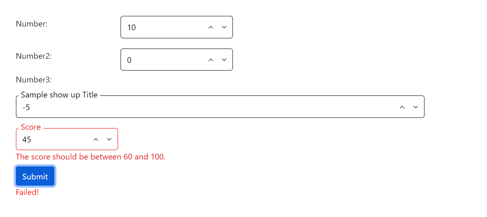
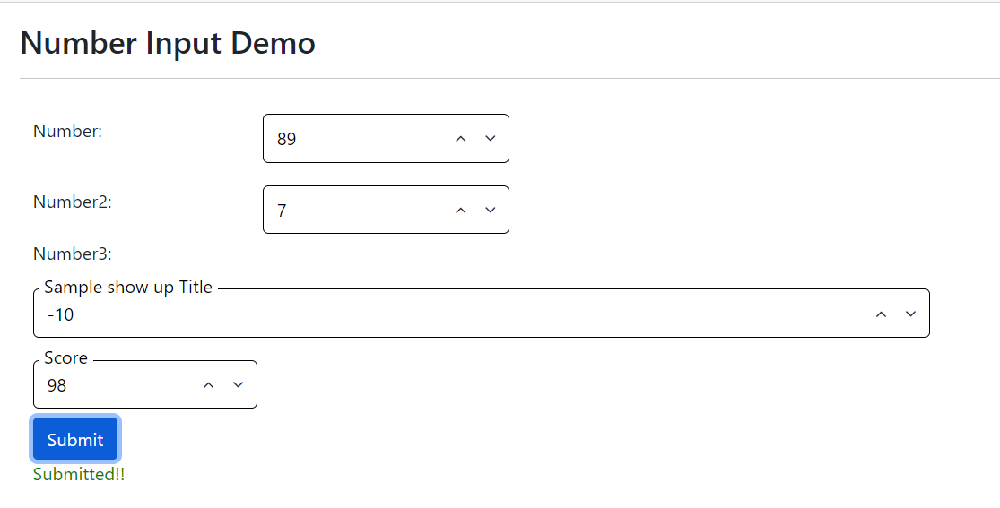

[Home](https://github.com/FreedomOnes82/MagicPropsBlazorComponents/blob/main/README.md)     

**Number Input**    
**Demo Images**:  
Here are a few demonstrative images that offer you a comprehensive overview of our number input component.    
  

**Introduction**:  
 This compponent is very similar as the input with type of number but it will had more settings for number input using, the following are the properties for it:  
* **Visible**: A boolean value (true or false) that controls whether this input element is visible on the interface. Setting it to false will hide the input from the user.
* **Readonly**: A boolean flag that specifies whether the input is read-only. When set to true, users cannot modify the input's value but can still copy and select the text.
* **Width**: Specifies the width of the input element. The minimum acceptable value is 60, allowing for flexible sizing to accommodate different design requirements.
* **Title**: Defines the title attribute for the input element, which can be displayed as a tooltip when the user hovers over the input.
* **InputID**: A unique identifier (id) for the input inside the component, allowing for specific targeting and styling via CSS or JavaScript,especially using as "for" with label before input.
* **ClientID**: A unique identifier (id) for this component, allowing for specific targeting and styling via CSS or JavaScript.
* **Value**: Sets the initial or current value of the input element. This can be used to pre-populate the input with data or to manage its state programmatically.
* **ValueChanged**: A function that can be assigned to this property. When the value of the input changes, this function is automatically triggered, allowing for dynamic updates or validation checks.
* **Increment**: This refers to the specified numerical amount that is added to the input number each time a button on the right is clicked. For example, if the increment value is set to 5, clicking the button will result in an addition of 5 to the current number, each and every time it is pressed.
* **Minimum**: This is the lowest number that can be entered or displayed in the number input field. It sets the lower boundary for the acceptable range of values.
* **Maximum**: Conversely, this represents the highest number that can be entered or displayed within the number input field. It establishes the upper boundary for the valid range of values.
* **Format**: The formatting string settings can incorporate all the formatting options accessible within the ToString() method in C#, such as "C" for currency, "D" for decimals, and "P" for percentages, and so forth. Furthermore, you have the flexibility to specify precision, for instance, using "C2" to display currency values with two decimal places.
* **CultureString**: Setting for culture string. Default value is "en-US".
* * **OnFocus**: A function that executes when the input element gains focus. This can be used to perform actions such as displaying additional instructions or clearing the input's value.
* **OnBlur**: A function that executes when the input element loses focus. This is useful for validating the input's value, clearing temporary UI elements, or performing other cleanup tasks.
          
Additionally, we can leverage Blazor EditForm for number input validation, utilizing a property specifically designed for this purpose:  
* **ValidationFieldName**: This property designates the field within a class that is bound to the EditForm for validation purposes. If the field's name coincides with the title of the input, this property can be omitted, and the title can be directly referenced for validation.

   