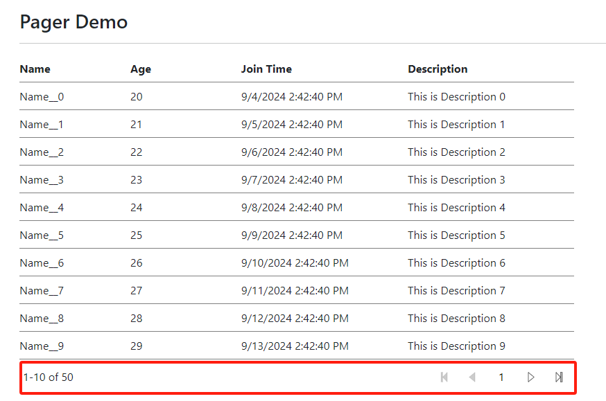

[Home](https://github.com/FreedomOnes82/MagicPropsBlazorComponents/blob/main/README.md)     

**Pager**    
**Demo Images**:  
The following demonstrative image offer you a comprehensive overview of our pager component.    
  

**Introduction**:  

 The Pager is utilized for implementing pagination when the content exceeds a single page capacity, here are the details about each setting:  
 * **TextContent**: Allows for the inclusion of HTML code or elements that are appended to the left of the pager, it has default html code there and we recommend to use the default one.
 * **PageSize**: Configures the number of items to display per page in this pagination component.
 * **PageIndex**: Specifies the index of the current page being displayed in the pagination sequence.
 * **TotalCount**: The total number of items in the list, utilized for pagination purposes.
 * **PageIndexChanged**: A function that can be assigned to this property. When page index changed a serial event trigger and run.
