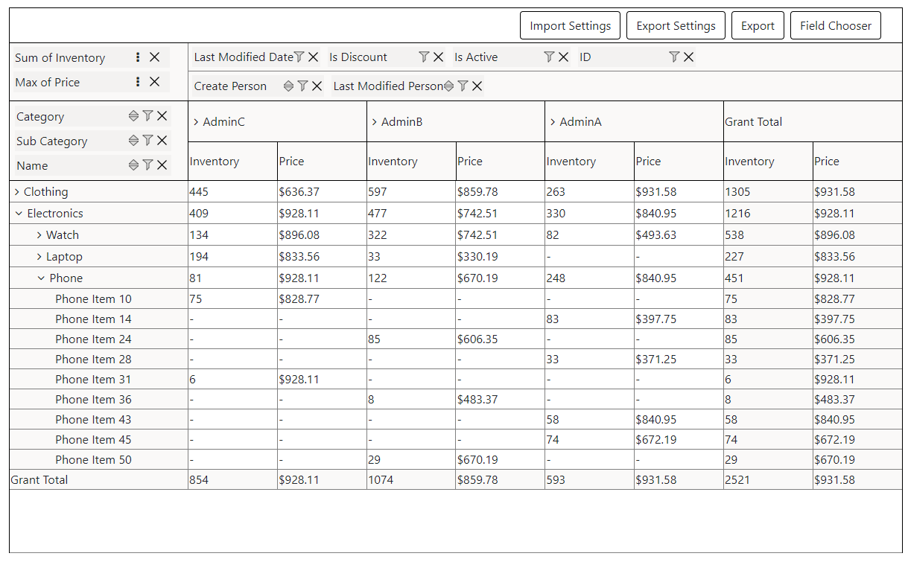
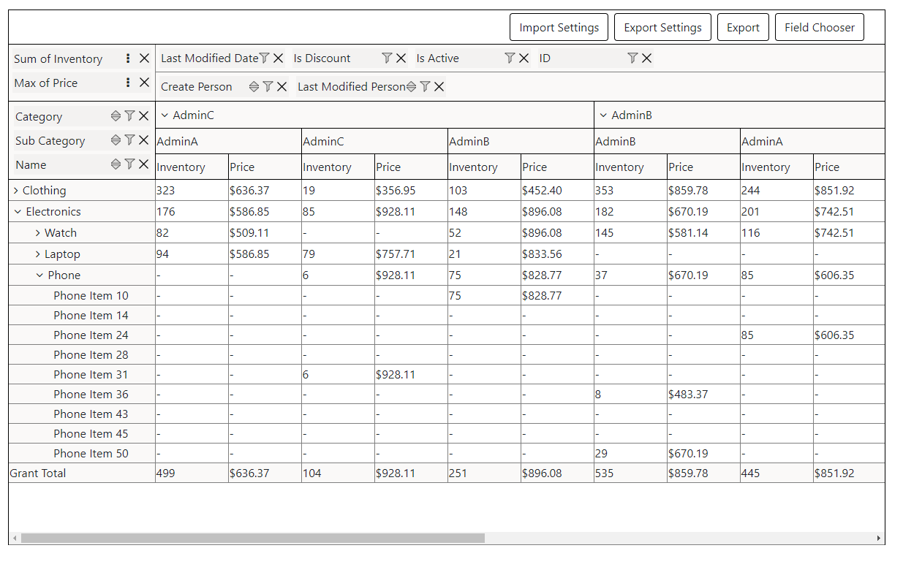
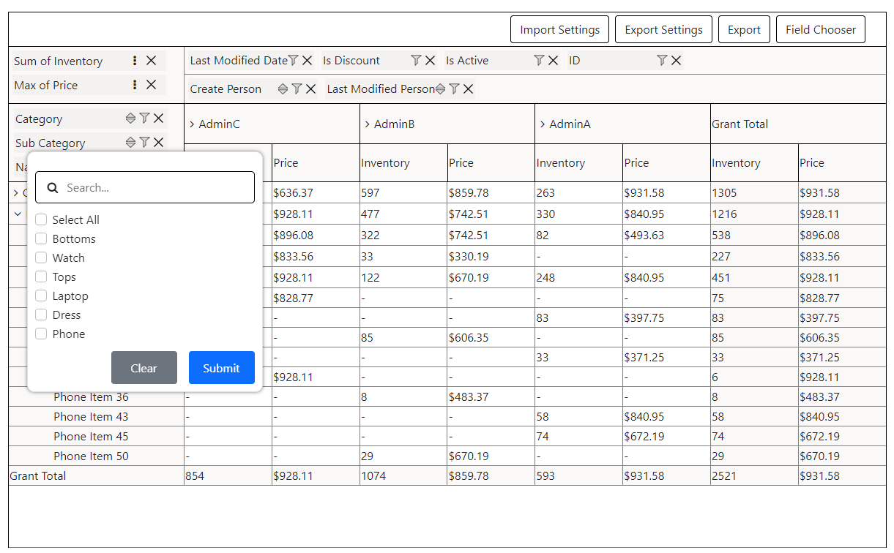
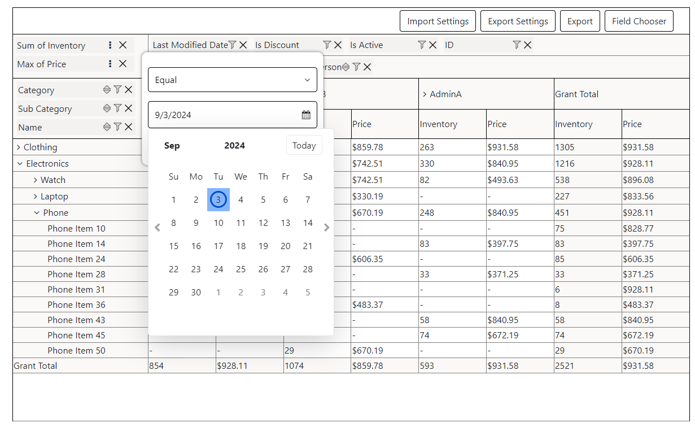
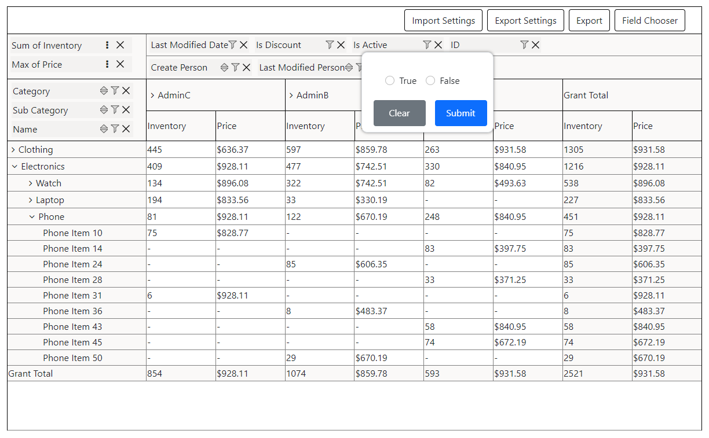
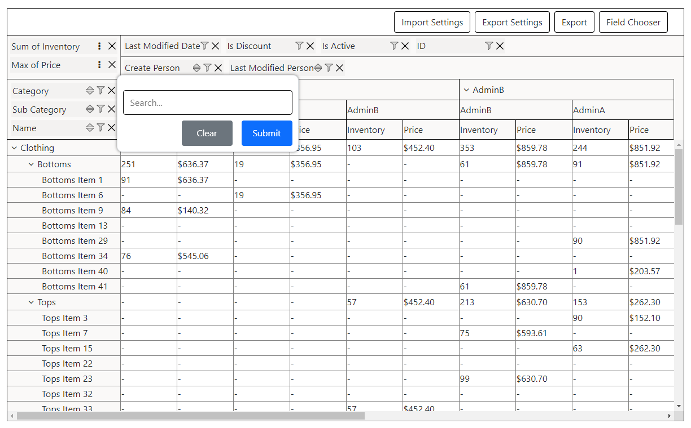

[Home](https://github.com/FreedomOnes82/MagicPropsBlazorComponents/blob/main/README.md)     

**Pivot Table**    
**Demo Images**:  
Here are a few demonstrative images that offer you a comprehensive overview of our pivot components.  
Privot table overview diagram:     

  
Pivot table filter chooser:
 
Pivot table filter part:   
  
  
  

**Introduction**:  

   A pivot table is a powerful tool in data analysis and reporting, it allows you to reorganize and summarize large amounts of data in a table format, making it easier to understand and analyze trends, patterns, and relationships within the data. 
   Here are the key properties related to the pivot table component (Including MPPivotTable,PivotTableDataSourceSettings and PivotField), which provide customization options for both its display and functionality:
   **MPPivotTable**:    
   * **ChildContent**: Permits the seamless integration of HTML code or elements, which can be appended to the individual items within timeline, typically achieved through the use of PivotTableDataSourceSettings.
   * **ShowSummarizedRows**: A boolean value (true or false) that determine whether the "Grant Total Row" appears or not. Default value is true.
   * **ShowSummarizedColumns**: A boolean value (true or false) that determine whether the "Grant Total Column" appears or not. Default value is true.
   * **Width**: Specifies the width of pivot table, default value is 1024. Please note: if you set the value less than 400, it will use 400 instead.
   * **Height**: Specifies the height of pivot table. 
   * **ClientID**: A unique identifier (id) for this component, allowing for specific targeting and styling via CSS or JavaScript.
    
   **PivotTableDataSourceSettings**:    
   * **DataSource**: Binding the datasource for the pivot table. It can be not only data from all kinds of database, such as MSSQL, MySQL, Postgresql and so on but also it can get data from JSON file.
   * **PivotRowsFields**: HTML code or elements, which can be appended to the rows area within pivot table, typically achieved through the use of PivotField within it.
   * **PivotColumnFields**: HTML code or elements, which can be appended to the columns area within pivot table, typically achieved through the use of PivotField within it.
   * **PivotFiltersFields**: HTML code or elements, which can be appended to the filters area within pivot table, typically achieved through the use of PivotField within it.
   * **PivotValuesFields**: HTML code or elements, which can be appended to the values Area within pivot table, typically achieved through the use of PivotField within it.
   * **CaseSensitive**: A boolean value (true or false) that determine whether the string value is case sensitive when comparison. Default value is false.
   * **ClientID**: A unique identifier (id) for this component, allowing for specific targeting and styling via CSS or JavaScript.
  
   **PivotField**:    
   * **Name**: Filed name from datasouce, this name should same as the name in database or json data etc.
   * **Caption**: Specifies name to show up in the page, for example, in database, the filed called 'fname' and in page you would like to called "First Name" then you need to specify "First Name" as Caption.
   * **ColumnType**: Specifies type for this field, the type you can used is "Default", "Date", "Number" and "Boolean". Many of filed can use "Default" as it is.
   * **SortType**: Specifies sort type for this field, the type you can used is "Default", "Ascending" and "Descending".
   * **FilterType**: Specifies filter type for this field, the type you can used is "DefaultFilter", "MenuListFilter" and "ConditionFilter". "DefaultFilter" means there is only a search input and you input value and filter exactly match the value you had inputted. "MenuListFilter" means it show up a list with all of the values the fileds maybe and user can select the checkbox with the values to do filters. "ConditionFilter" means it will show up a lot of conditions so that user can choose related condition to do the fitlers.
   * **Format**:  Setting for format showing up for this filed, only used in PivotValuesFields part. Please note: since you can drap and drop to change the fileds position, that is, for example, you can drap PivotColumnFields and drop it to PivotValuesFields, please do correct setting for this if want to use it later.
   * **CultureString**: Setting for culture string showing up for this filed, only used in PivotValuesFields part. Please note: since you can drap and drop to change the fileds position, that is, for example, you can drap PivotColumnFields and drop it to PivotValuesFields, please do correct setting for this if want to use it later.
   * **AggregateFunction**: Setting for calculation method for the fileds, the value should be "Count", "DistinctCount", "Sum", "Min","Max" or "Average".

  
