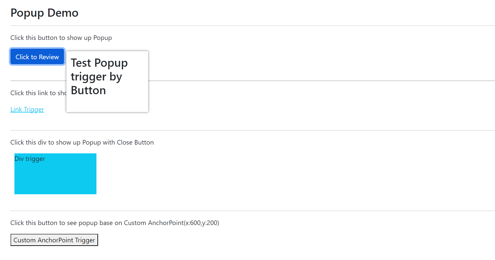
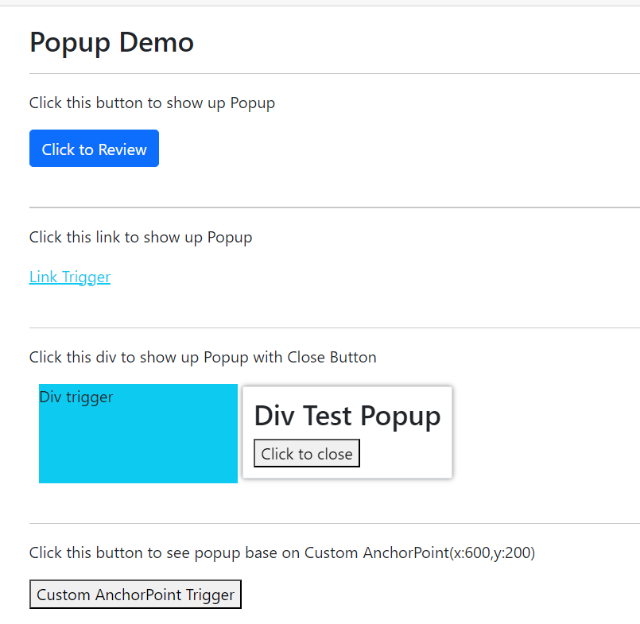

[Home](https://github.com/FreedomOnes82/MagicPropsBlazorComponents/blob/main/README.md)     

**Tab Group**    
**Demo Images**:  
Here are a few demonstrative images that offer you a comprehensive overview of our popup component.    
  

**Introduction**:  
The Popup employs a serial setting to display various pop-ups, distinguishing itself from modal windows primarily in terms of size, flexibility, and positioning. While modals are often fixed in size and maintain a static position on the page, pop-ups offer much greater flexibility. They allow for customization in terms of their anchor point, enabling them to position themselves dynamically relative to this anchor point, making them highly adaptable to various contexts and user interfaces.  
Here are the details about each setting:  
* **Width**: Specifies the width of the popup.
* **Height**: Specifies the height of the popup.
* **TriggerEleID**: Unique identifier assigned to the element that initiates the display of this popup.
* **ClientID**: A unique identifier (id) for this component, allowing for specific targeting and styling via CSS or JavaScript.
* **ShowCloseButton**: True or False, to control if the close button visible or not
* **PopupShadowSettings**:This feature allows you to adjust the settings for the shadow displayed around popups. It comes with pre-defined default values, but you have the flexibility to customize them according to your preference."
* **Spacing**: A configuration option allows for the customization of the spacing style within popups, with a default value of 5 pre-set for your convenience. This enables you to fine-tune the layout and create a more personalized and visually harmonious user experience.
* **Padding**: A configuration option enables you to tailor the padding style of your popup, featuring a default value of 10 that provides a balanced starting point for enhancing the interior spacing and overall aesthetic appeal of your popup content.
* **BorderRadius**: A customizable configuration option for the Border Radius style of your popup offers a default value of 10, allowing you to effortlessly achieve a sleek and modern look by adjusting the curvature of the popup's corners. This setting enhances the visual appeal and contributes to a more user-friendly interface.
* **BorderSettings**: A flexible configuration option for the Border style of your popup permits you to customize its appearance beyond the default value, offering the freedom to alter the border's design to suit your specific needs and preferences. This allows for a more personalized and visually appealing popup that seamlessly integrates into your overall interface design.
* **ChildContent**: Permits the seamless integration of HTML code or elements, which can be appended to the individual option. This feature enhances the flexibility and customizability of popup, allowing for the inclusion of additional information, styling, or interactive elements alongside this option.
* **AnchorPointType**: Set the vertex of the trigger as the anchor point, the value can be AnchorPointType.TriggerLeftTop,AnchorPointType.TriggerLeftBottom,AnchorPointType.TriggerRightTop,AnchorPointType.TriggerRightBottom and AnchorPointType.TriggerCenter.
* **AnchorPointX**: X value for Anchor point if you would not use vertext of trigger as anchor point.
* **AnchorPointY**: Y value for Anchor Point if you would not use vertext of trigger as anchor point.
* **Toward**: The direction of the popup's appearance or positioning determined based on the anchor point, the value can be PopupToward.TopLeft,PopupToward.TopRight,PopupToward.BottomLeft,PopupToward.BottomRight,PopupToward.TriggerTopCenter,PopupToward.TriggerBottomCenter,PopupToward.TriggerLeftCenter and PopupToward.TriggerRightCenter.   
* **Visible**: A boolean value (true or false) to control the popup shows up or not.
* **OnAfterHidePopup**: A function that can be assigned to this property to handle event trigger when hide popup.
* **OnAfterPopupRender:**: A function that can be assigned to this property to handle event trigger when popup appear.Only refresh/execute when popup is visible.
* **Show**: A function used to show the popup.
* **Hide**: A function used to hide the popup.