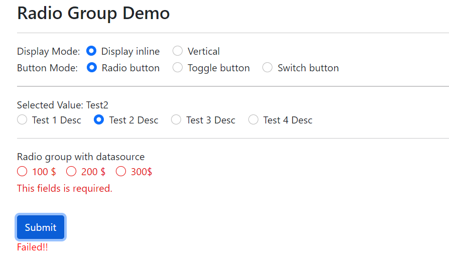
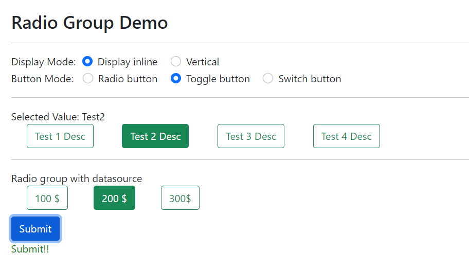
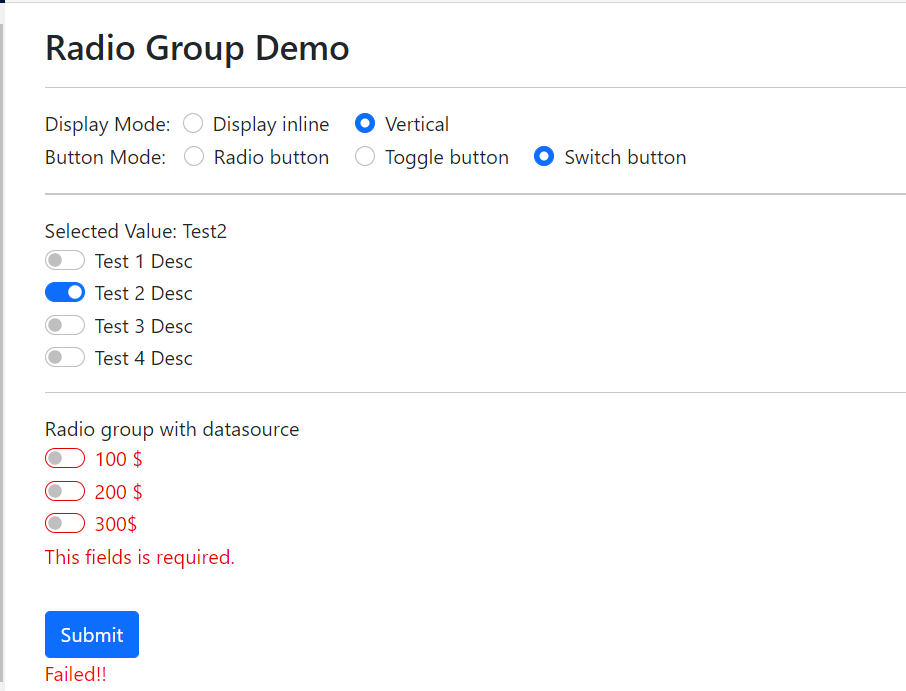
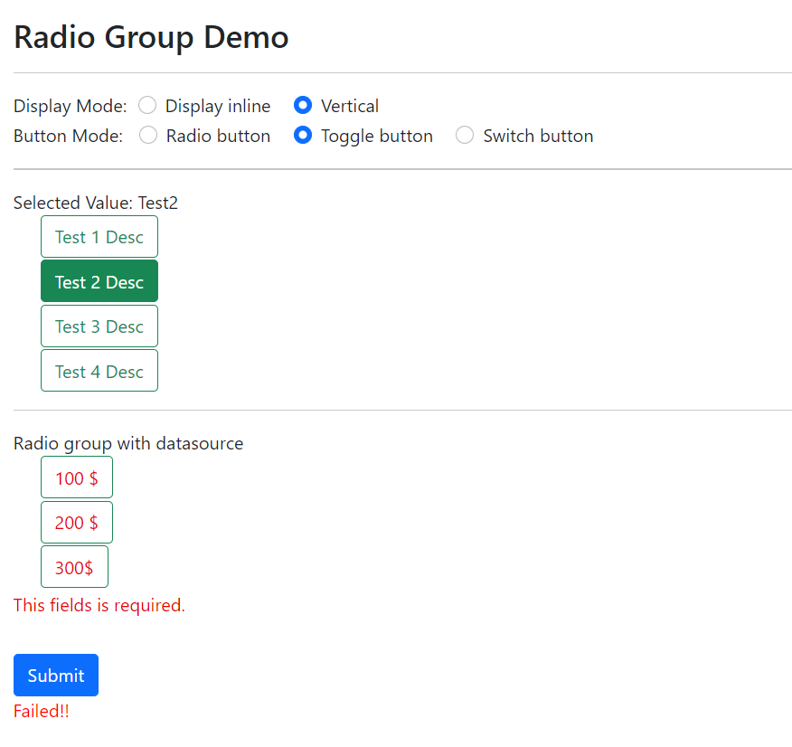
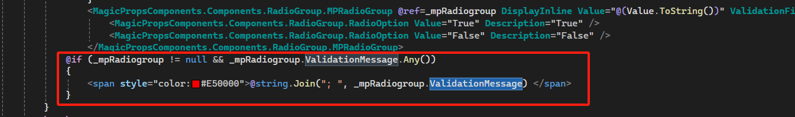

[Home](https://github.com/FreedomOnes82/MagicPropsBlazorComponents/blob/main/README.md)     

**Radio Group**    
**Demo Images**:  
Here are a few demonstrative images that offer you a comprehensive overview of our radio group component.    
     

    

  

**Introduction**:  
This component comprises a group of radio boxes, offering flexibility in how they are displayed: either inline for a compact view or vertically for clarity. Additionally, you have the option to customize the appearance of the buttons within these radio boxes in three distinct styles:
* Standard Radio Button: The traditional circular button with a dot indicator for selection.
* Toggle Button: A custom, interactive button designed to toggle between a checked (selected) and unchecked (unselected) state, offering a visually appealing alternative to traditional radio buttons.
* Switch Button: A sliding switch design, commonly used for binary choices, providing a clear visual representation of the on/off or selected/unselected state.  

Here are the key properties related to the radio group component (Including MPRadioGroup and MPRadioOption), which provide customization options for both its display and functionality:  
**MPRadioGroup**:    
* **ChildContent**: Permits the seamless integration of HTML code or elements, which can be appended to the individual items within the group, typically achieved through the use of MPRadioOption or similar components. This feature enhances the flexibility and customizability of the radio group, allowing for the inclusion of additional information, styling, or interactive elements alongside each option.
* **Name**: Configuration option for specifying the unique name of the radio group. This setting is crucial for ensuring proper functionality and differentiation between multiple radio groups on the same page, allowing users to make independent selections within each group.
* **DisplayInline**: True or False, a setting to determine whether radio groups are displayed in an inline (horizontal) arrangement or a vertical stack. This option allows for customization of the layout, catering to different design preferences and ensuring that radio groups fit seamlessly within the overall user interface.
* **DisplayMode**: A configuration option for customizing the display style of buttons within the radio group. The available values include "DisplayModes.DefaultButton" for the standard button appearance, "DisplayModes.ToggleButton" for a custom-style button that indicates an selected or unselected state, and "DisplayModes.SwitchButton" for a sliding switch button that provides a more intuitive and interactive user experience. This setting enhances the visual appeal and usability of the radio group, allowing for a more tailored design that matches the overall look and feel of the application.
* **Value**: A configuration option that specifies the default selected value for the radio group. This setting ensures that when the group is first rendered, one of the radio buttons is automatically selected, based on the predefined value. This feature is useful for pre-populating forms or indicating a recommended or default option to users.
* **Datasource**: A configuration option that allows for the binding of a data source to the radio group, where the data source is of the Dictionary<string, string> type. This feature enables dynamic population of the radio group options, with each key-value pair representing a unique radio button option. The keys serve as the values for the radio buttons, while the values can be used as display labels or additional metadata associated with each option. This approach simplifies the process of managing and updating radio group options, especially in scenarios where the options are sourced from a database or external data source.
* **ValueChanged**: A function that can be assigned to this property. When the selected value of the radio group changes, this function is automatically triggered, allowing for dynamic updates or validation checks.
      
**MPRadioOption**:  
* **Description**: Customizing the Label Name for the Radio Button Option
* **Value**: Specifying the Default Selected Option within Radio Button Groups.
* **ButtonClass**:  Custom Class Configuration for the Button when Display Mode is Set to "DisplayModes.ToggleButton"
        
Additionally, we can leverage Blazor EditForm for input validation, utilizing a property specifically designed for this purpose:  
* **ValidationFieldName**: This property designates the field within a class that is bound to the EditForm for validation purposes and it is required if you would like the validation working well.

In addition to the parameters mentioned, for this component, we require a List<string> named ValidationMessage. 
This list captures and stores error messages encountered during validation, enabling you to utilize them and display them on the page as necessary.
Here's how to use the ValidationMessage:

   
