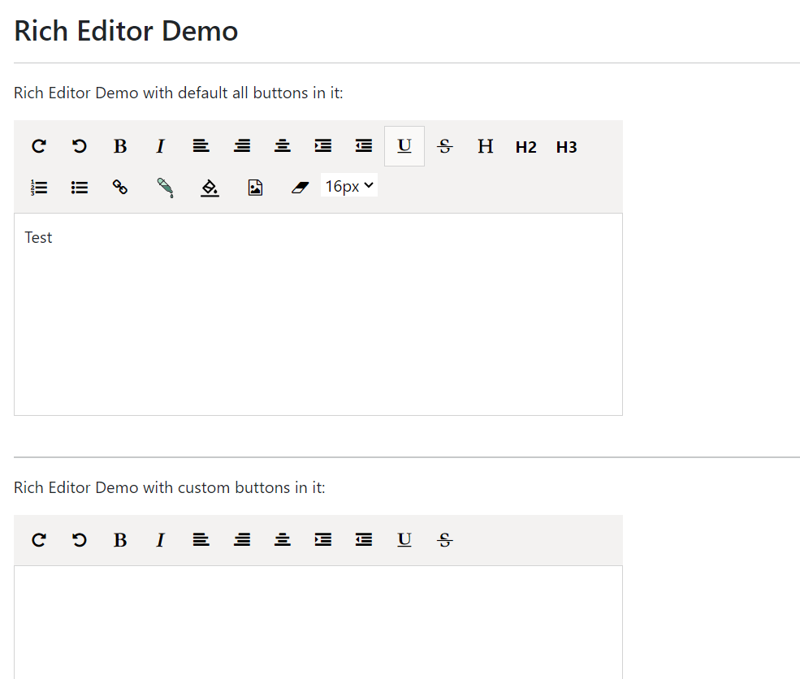

[Home](https://github.com/FreedomOnes82/MagicPropsBlazorComponents/blob/main/README.md)     

**Rich Editor**    
**Demo Images**:  
Here is a demonstrative image that offer you a comprehensive overview of our rich editor component.    

**Introduction**:  

The Rich Editor component enables users to input text in various formats in a What-You-See-Is-What-You-Get (WYSIWYG) manner, providing a seamless and intuitive interface for rich text editing. 
Here are the refined details for each property along with its respective function:   
* **ClientID**: A unique identifier (id) for this component, allowing for specific targeting and styling via CSS or JavaScript.
* **Width**: Specifies the width of this component. The default value is 1000, allowing for flexible sizing to accommodate different design requirements.
* **Height**: Specifies the height of this component. The default value is 700, allowing for flexible sizing to accommodate different design requirements.
* **Buttons**: Settings about List<DocumentButtons> for the header buttons within this rich editor. We have default setting for this to show up all of the buttons we have in it. However, you have the flexibility to adjust this configuration to display only the specific buttons that you require.
