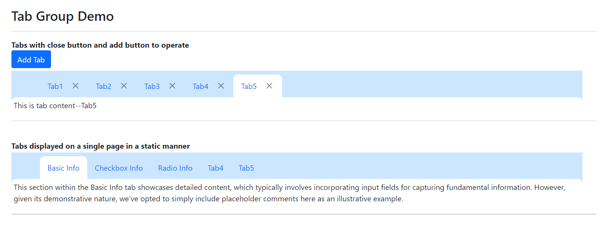

[Home](https://github.com/FreedomOnes82/MagicPropsBlazorComponents/blob/main/README.md)     

**Tab Group**    
**Demo Images**:  
The following demonstrative image offer you a comprehensive overview of our tab group component.    

**Introduction**:  

This component is designed to display a flexible or static group of tabs on the page, providing you with the freedom to choose based on your preferences.
Here are the key properties related to the tab group component (Including MPTabGroup and MPTabOption), which provide customization options for both its display and functionality:  
**MPTabGroup**:    
* **ChildContent**: Permits the seamless integration of HTML code or elements, which can be appended to the individual items within the group, typically achieved through the use of MPTabOption or similar components. This feature enhances the flexibility and customizability of the tab group, allowing for the inclusion of additional information, styling, or interactive elements alongside each option.
* **ShowTabs**:  To identify whether the tabs should be displayed or not, a Boolean value (True or False) is used, with the default value typically set to True to ensure that the tabs are shown by default.
* **NeedDeleteConfirm**: The setting utilizes a True or False value to specify whether a confirmation popup should appear when attempting to delete a tab from the group.
* **SelectedTabHeadText**: Configuration for the default selected tab.
* **SelectedTabHeadTextChanged**: A function that can be assigned to this property. When the selected tab of the group changes, this function is automatically triggered, allowing for dynamic updates or validation checks etc..
      
**MPTabOption**:  
* **ItemID**: Configuration for id for each tab option.
* **Header**: Configuration for the text displayed on the tab.
* **Icon**: Defines the HTML code for the icon to be displayed within the tab header.
* **HeaderTemplate**: Allows for the inclusion of HTML code or elements that are appended to the header of the tab.
* **Active**:  The "active" status of a tab can be enabled or disabled by setting it to True or False, respectively. If multiple tabs are configured as active, the system will prioritize the first one and make it active, ensuring only one tab is active at a given time.
* **OnAfterActivateTab**:  A function that can be assigned to this property. When the active tab, this function is automatically triggered, allowing for dynamic updates or do some other events.
* **OnCloseTab**:  A function that can be assigned to this property. When the close the tab, this function is automatically triggered, allowing for dynamic updates or do some other events.
* **Closable**:  To identify whether a tab can be closed or not, a True or False value is used. Setting this to True allows the tab to be closed, while False disables the closing functionality.
* **ChildContent**: Permits the seamless integration of HTML code or elements, which can be appended to the individual option. This feature enhances the flexibility and customizability of the tab option, allowing for the inclusion of additional information, styling, or interactive elements alongside this option.
  
