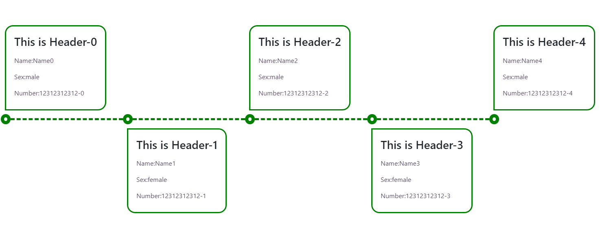
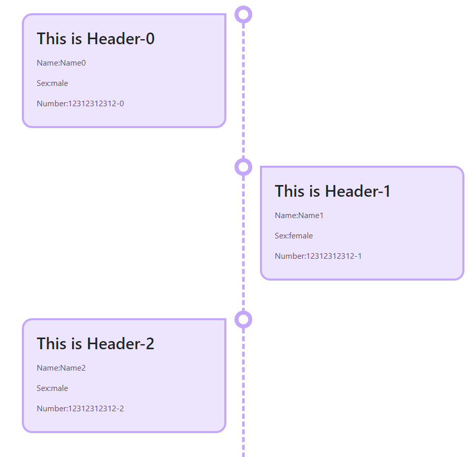

[Home](https://github.com/FreedomOnes82/MagicPropsBlazorComponents/blob/main/README.md)     

**Timeline**    
**Demo Images**:  
Here are a few demonstrative images that offer you a comprehensive overview of our timeline component.    
Horizontal Timeline
  
Vertical Timeline  

**Introduction**:  

A timeline is a component designed to elegantly showcase events in a clear, sequential order, enabling users to effortlessly follow the progression of milestones and occurrences.  
Here are the key properties related to the timeline component (Including MPTimeline and MPTimelineItem), which provide customization options for both its display and functionality:  
**MPTimeline**:    
* **ChildContent**: Permits the seamless integration of HTML code or elements, which can be appended to the individual items within timeline, typically achieved through the use of MPTimelineItem or similar components.
* **ClientId**: A unique identifier (id) for this component, allowing for specific targeting and styling via CSS or JavaScript.
* **Color**: Configuration for color using for such as border and process line for timeline.
* **ItemBgColor**: Configuration for background color using for each timeline item for timeline.  
* **Size**: Setting for the size for this timeline, it can be "Size.Small","Size.Large" and "Size.Medium".  
* **Visible**: A boolean value (true or false) to control the timeline shows up or not.  
* **Vertical**: A boolean value (true or false) to control the timeline is displayed vertically or horizontally.
* **ItemCount**: The total number item for this timeline.
     
**MPTimelineItem**:  
* **HeaderTemplate**: Allows for the inclusion of HTML code or elements that are appended to the header of the timeline item.
* **BodyTemplate**: Allows for the inclusion of HTML code or elements that are appended to the body of the timeline item.
* **ItemIndex**: Configuration for index of this timeline item in the timeline.
  
  
