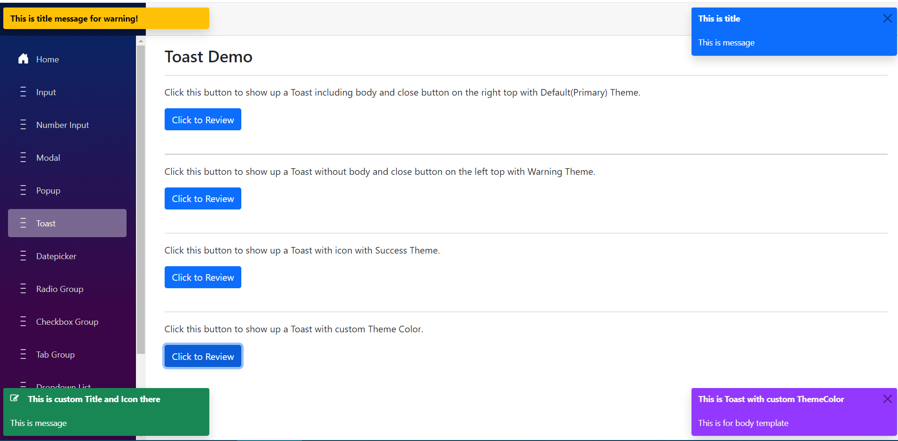
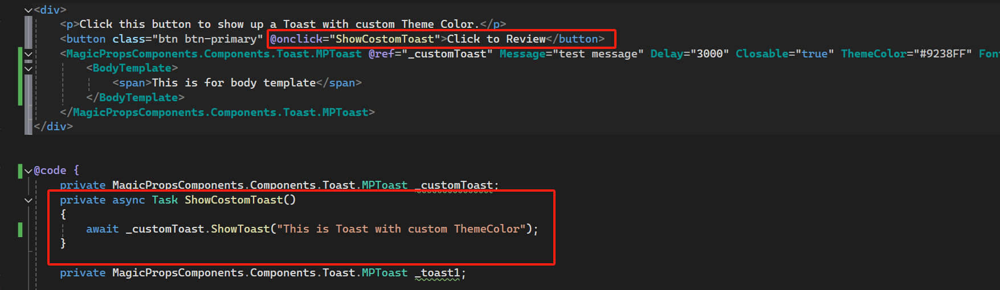

[Home](https://github.com/FreedomOnes82/MagicPropsBlazorComponents/blob/main/README.md)     

**Toast**    
**Demo Images**:  
The following demonstrative image offer you a comprehensive overview of our toast component.  

**Introduction**:  

 Toast is a user-friendly component designed to present a concise and temporary pop-up message, informing the user of the status or outcome of an operation in a non-intrusive manner.
 Here are the details about each setting:   
 * **HeaderTemplate**: Allows for the inclusion of HTML code or elements that are appended to the title part of the component.
 * **BodyTemplate**: Allows for the inclusion of HTML code or elements that are appended to the body of the component.  
 * **Message**: If a BodyTemplate is not present, this message will serve as the default body content for the component. However, if a BodyTemplate exists, the component will prioritize the use of the BodyTemplate over this message.
 * **ThemeColor**: A property designed to allow customization of the toast's background color.
 * **FontColor**:A property designed to allow customization of the toast's font color, default value is white.
 * **Closable**: A property to mange whether a close button should be displayed in the top-right corner of the toast, enabling users to manually dismiss the toast message if desired, default value is false.
 * **AutoHide**: A property to control if the toast can auto hide or not, default value is true. We recommoned to use default value for this, if you want to set it as false, there should set Closable as true to make sure user can close the toast.
 * **Style**: Setting for the style for this toast if you want. It should be css style string there.
 * **Delay**: Setting for how many times the toast will be colsed, default value is 5000 millisecond.
 * **ClientID**: A unique identifier (id) for this component, allowing for specific targeting and styling via CSS or JavaScript.
 * **Position**: A property to control where the toast will be show up in the page.The value should be "ToastPosition.TopLeft,"ToastPosition.TopRight","ToastPosition.BottomLeft" and "ToastPosition.BottomRight".  

In addition to the parameters mentioned, for this component, we require a function named ShowToast. This function is essential for triggering the display event of the toast, making it visible to the user.   
Here's how to use the ShowToast function:

